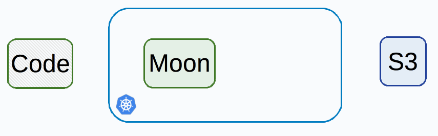
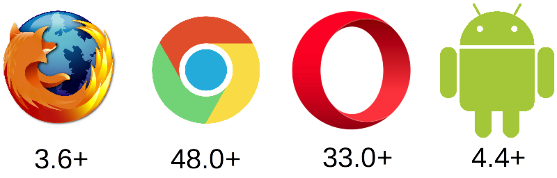
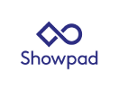

# Moon
[](https://hub.docker.com/r/aerokube/moon)

Moon is a commercial closed-source solution for organizing browser automation infrastructure. It is fully compatible with [Selenium](https://selenium.dev/), [Playwright](https://playwright.dev/), [Cypress](https://cypress.io) and [Puppeteer](https://pptr.dev/). Moon is using [Kubernetes](https://kubernetes.io/) or [Openshift](https://www.redhat.com/en/technologies/cloud-computing/openshift) to launch browsers.



## Pricing Model

* The only limitation that determines final Moon price is the **total number of browser pods** being run in parallel.
* You can run up to **4 (four)** parallel pods for free. Everything on top of free limit is paid as a subscription.
* **Detailed pricing** information is available in respective documentation [section](https://aerokube.com/moon/latest/#_pricing).
* You can obtain **a free evaluation license key** on our [web-site](https://aerokube.com/moon/).

## Free Support

* Detailed [documentation](http://aerokube.com/moon/latest/)
* Telegram [support channel](https://t.me/aerokube_moon)
* Support by [email](mailto:support@aerokube.com)
* StackOverflow [tag](https://stackoverflow.com/questions/tagged/aerokube-moon)
* Issue [tracker](https://github.com/aerokube/moon/issues)
* YouTube [channel](https://www.youtube.com/channel/UC9HvE3FNfTvftzpvXi9c69g)

## Features

The main idea behind Moon is to be easily installable and require zero maintenance.

### One-command Installation

Having a running [Kubernetes](https://kubernetes.io/) cluster and `kubectl` pointing to it, you can launch free Moon cluster by typing commands below:

```(bash)
$ helm repo add aerokube https://charts.aerokube.com/
$ helm repo update
$ helm upgrade --install --create-namespace -n moon moon aerokube/moon2
```

See our [documentation](https://aerokube.com/moon/latest/#install) for more installation options. 

### Automatic Browser Management



* We maintain ready to use images for **Firefox**, **Chrome**, **Opera** and **Android**.
* New browser versions are automatically accessible right after releases.

### Scalability and Fault Tolerance

* Your cluster size is **automatically** determined by Kubernetes depending on the load.
* Moon is completely **stateless** and allows to run an **unlimited** number of replicas behind load balancer.
* **No additional configuration** is required to add a new Moon replica.
* **User requests are not lost** even in case of an accidental crash or downtime of the replica.

### Efficient and Lightning Fast

* Moon is implemented using lightning fast [Golang](https://golang.org/).
* One Moon replica consumes **0.5 CPU** and **512 Mb RAM** maximum.
* One Moon replica is able to work with **thousands** of running sessions.

### Logs and Video

* You can access live browser screen and logs for debugging purposes during test run.
* Any browser session can be saved to a video file using desired codec, frame rate and screen size.
* Logs and video files can be automatically uploaded to [S3](https://en.wikipedia.org/wiki/Amazon_S3)-compatible storage.

## Complete Guide

Complete reference guide can be found at: http://aerokube.com/moon/latest/

## Users

[](https://www.ozon.ru/) [](https://www.frontiercargroup.com/) [](https://www.socialtechnologies.io/)  [](https://www.showpad.com/)
